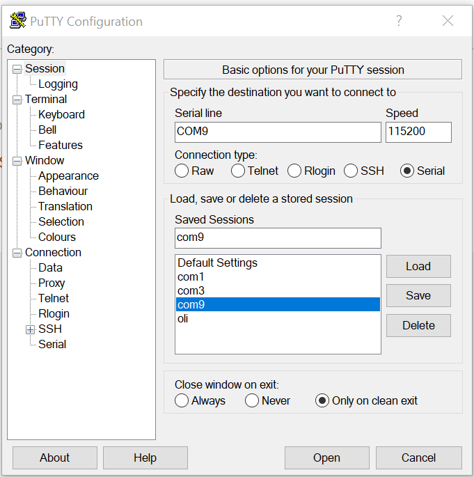

Terminal access from host computer
==================================

Accessing with PuTTY
--------------------

1. Power on the board.
2. Use the USB to UART cable to connect your computer with the board via *1. UART*.
3. Check the *Device Manager* to see as which *COM* the USB connected.
4. For example, it would come up as *COM9*, configure PuTTY as follows:

5. Hit "Open" and you should get terminal access to your board. Sometimes you have to hit the [Enter] key before you get an output.
